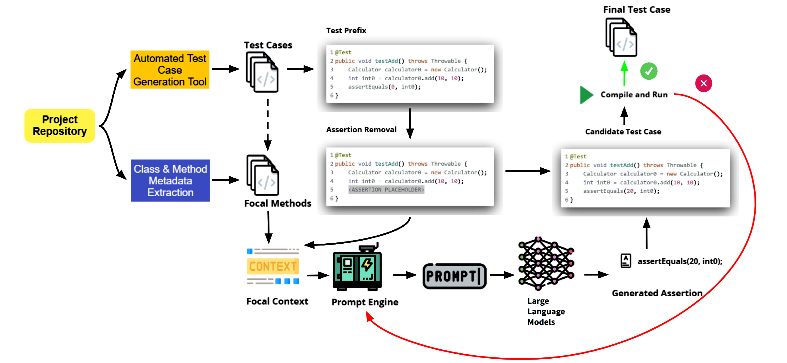

# AugmenTest: Enhancing Tests with LLM-driven Oracles


[](https://zenodo.org/records/13881826)

AugmenTest is an advanced automated test oracle generation system that leverages Large Language Models (LLMs) to enhance software testing efficiency. The tool generates JUnit test assertions for test cases (automatically generated or developer written) utilizing code documentations and developer code comments, serving as an intelligent oracle for Java applications.

**Research Paper**: This tool accompanies our paper _"AugmenTest: Enhancing Tests with LLM-driven Oracles"_. The complete replication package is available on [Zenodo](https://zenodo.org/records/13881826).

## Key Features

- 🧠 **LLM Integration**: Supports multiple LLM backends including GPT-4All and OpenAI
- 🧪 **Automated Assertion Generation**: Creates precise test assertions using code context
- 🔄 **Multi-Variant Prompting**: Implements different prompting strategies (Simple, Extended, RAG)
- 📊 **Test Augmentation**: Enhames existing automatically generated or developer written tests with intelligent oracles
- 🔍 **Context-Aware**: Utilizes code structure, developer comments, code documentations and dependencies

## Approach Overview



## Getting Started

### Prerequisites

- Python 3.9+
- Java 8+
- GPT4All or OpenAI API access

### Installation

1. Clone the repository:
   ```bash
   git clone git@github.com:se-fbk/augmentest.git
   cd augmentest
   ```

2. Set up virtual environment:
   ```bash
   python -m venv augmentest_venv
   source augmentest_venv/bin/activate  # Linux/Mac
   .\augmentest_venv\Scripts\activate  # Windows
   ```

3. Install dependencies:
   ```bash
   pip install -r requirements.txt
   ```

4. Prepare LLM Models (Choose one option):

   **Option A: Local GPT4All Models**
   ```bash
   # Download quantized models from:
   # https://docs.gpt4all.io/gpt4all_desktop/models.html#download-models
   # Recommended models:
   # - Nous-Hermes-2-Mistral-7B-DPO.Q4_0.gguf
   # - mistral-7b-openorca.Q4_0.gguf

   mkdir -p models/
   # Move downloaded .gguf files to models/ directory
   ```

   **Option B: OpenAI API**
   ```bash
   # No additional downloads needed
   # Just configure your API key in config.ini
   ```

   **Option C: Other APIs/Models (Gemini/DeepSeek/etc)**
   ```bash
   # Install additional requirements as needed:
   # implement the APIs in class: llm_prompter.py
   ```
5. Configure environment:
   ```bash
   cp config.ini.example config.ini
   nano config.ini  # or use your preferred editor
   ```
   Edit the following sections:
   ```ini
   [DEFAULT]
   ; For Local Models
   llm_base_path = ./models/  # Path to your .gguf files
   DEFAULT_MODEL = Nous-Hermes-2-Mistral-7B-DPO.Q4_0.gguf

   ; For OpenAI
   [openai]
   api_key = your-api-key-here
   DEFAULT_MODEL = gpt-4-turbo

   ; For other APIs
   # deepseek_api_key = your-key
   # gemini_api_key = your-key
   ```

## Usage Options

### Option 1: Manual Two-Step Process

1. **Preprocess Test Cases**:
   ```bash
   python run_preprocess_test_cases.py <project_dir> <language>
   # Example: 
   python run_preprocess_test_cases.py /path/to/project java
   # Note: Currently supports only Java projects (Python support coming soon)
   ```

2. **Generate Oracles Individually**:
   ```bash
   python run_oracle_generation.py <test_id> <project_dir> <class_name> <method_name> <model> <variant> <use_comments>
   # Example:
   python run_oracle_generation.py T001 /path/to/project MyClass test1 \
   Nous-Hermes-2-Mistral-7B-DPO.Q4_0.gguf SIMPLE_PROMPT true
   ```

### Option 2: Automated Batch Processing (Recommended)

```bash
python run_augmentest.py <project_dir> <language>
# Example:
python run_augmentest.py /path/to/project java
# This automatically performs:
# 1. Test case preprocessing
# 2. Oracle generation for all test cases
```

## Configuration

Edit `config.ini` to customize:

```ini
[DEFAULT]
output_dir = ./output/
model_path = ./models/
openai_api_key = your-key-here
# ... other configurations
```

## Supported LLM Models

- Local Models:
  - GPT4All
- Cloud Models:
  - OpenAI GPT-4o

## Research and Citation

This work accompanies our research paper:  
**"AugmenTest: Enhancing Tests with LLM-driven Oracles"**

📦 **Replication Package**:  
All experimental data, benchmarks, and additional resources are available in our [Zenodo replication package](https://zenodo.org/records/13881826).

📄 **Citation**:
```bibtex
@misc{khandaker2025augmentestenhancingtestsllmdriven,
      title={AugmenTest: Enhancing Tests with LLM-Driven Oracles}, 
      author={Shaker Mahmud Khandaker and Fitsum Kifetew and Davide Prandi and Angelo Susi},
      year={2025},
      eprint={2501.17461},
      archivePrefix={arXiv},
      primaryClass={cs.SE},
      url={https://arxiv.org/abs/2501.17461}, 
}

```
```bibtex
@dataset{khandaker_2024_13881826,
  author       = {Khandaker, Shaker Mahmud and
                  Kifetew, Fitsum and
                  Prandi, Davide and
                  Susi, Angelo},
  title        = {AugmenTest: Enhancing Tests with LLM-driven
                   Oracles - Replication package
                  },
  month        = oct,
  year         = 2024,
  publisher    = {Zenodo},
  doi          = {10.5281/zenodo.13881826},
  url          = {https://doi.org/10.5281/zenodo.13881826},
}
```

## License

This project is licensed under the Apache License 2.0 - see the [LICENSE](LICENSE) file for details.

## Contact

### Core Team

**Shaker Mahmud Khandaker** (Maintainer)  
📧 shakerkhandaker1193@gmail.com  
🌐 [www.khandakerrahin.com](https://www.khandakerrahin.com/)  
🔗 [LinkedIn](https://www.linkedin.com/in/khandakerrahin/)  
🐦 [@khandakerrahin](https://twitter.com/khandakerrahin)  

**Fitsum Meshesha Kifetew**  
📧 kifetew@fbk.eu  
🌐 [kifetew.github.io](https://kifetew.github.io/)  
🔗 [LinkedIn](https://www.linkedin.com/in/fitsum-meshesha-kifetew-b1bb2015/)  

**Davide Prandi**  
📧 prandi@fbk.eu  
🌐 [se.fbk.eu/team/prandi](https://se.fbk.eu/team/prandi)  
🔗 [LinkedIN](https://www.linkedin.com/in/davide-prandi-26319421/)  

**Angelo Susi**  
📧 susi@fbk.eu  
🌐 [se.fbk.eu/team/susi](https://se.fbk.eu/team/susi)  
🔗 [LinkedIN](https://www.linkedin.com/in/angelo-susi/)  

### Academic Collaborations
For research-related inquiries, please contact the maintainer with "[AugmenTest Research]" in the subject line.
