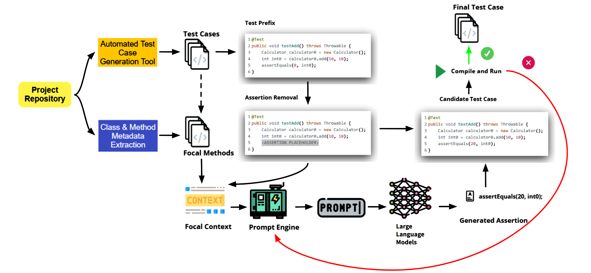
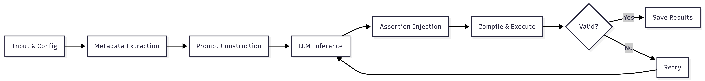

# AugmenTest: Enhancing Tests with LLM-driven Oracles


[](https://zenodo.org/records/13881826)

AugmenTest is aresearch tool that automates test oracle generation by leveraging Large Language Models (LLMs) to enhance software testing efficiency. The tool generates JUnit test assertions for test cases (automatically generated or developer written) utilizing code documentations and developer code comments, serving as an intelligent oracle for Java applications.

**Research Paper**: This tool accompanies our paper _"AugmenTest: Enhancing Tests with LLM-driven Oracles"_. The complete replication package is available on [Zenodo](https://zenodo.org/records/13881826).

## Key Features

- 🧠 **LLM Integration**: Supports multiple LLM backends including GPT-4All and OpenAI
- 🧪 **Automated Assertion Generation**: Creates precise test assertions using code context
- 🔄 **Multi-Variant Prompting**: Implements different prompting strategies (Simple, Extended, RAG)
- 📊 **Test Augmentation**: Enhames existing automatically generated or developer written tests with intelligent oracles
- 🔍 **Context-Aware**: Utilizes code structure, developer comments, code documentations and dependencies

---

## Approach Overview



## Workflow Pipeline Overview



# Requirements

Docker is required.

The container includes:

* Python 3.12
* Java (Temurin)
* Maven
* Tree-sitter
* All required dependencies

---

# Build

From repository root:

```bash
docker build -t augmentest .
```


---

# LLM Server

AugmenTest requires an HTTP-accessible LLM endpoint (default: port 8000).

We provide cross-platform startup scripts.

### Linux / macOS

```bash
./scripts/start_llm_server.sh
```

### Windows (PowerShell)

```powershell
powershell -ExecutionPolicy Bypass -File .\scripts\start_llm_server.ps1
```

### Windows (CMD)

```cmd
scripts\start_llm_server.bat
```

These scripts:

* Create a local `LLMs/` directory (if missing)
* Download the default model
  `qwen2.5-coder-7b-instruct-q2_k.gguf`
* Pull the `llama.cpp` Docker server image
* Start the server container
* Expose the model at:

```
http://localhost:8000
```

You may edit the scripts to:

* Change model
* Change model directory
* Change port
* Change token limit

Alternatively, any LLM exposed via HTTP can be used (local server, cluster, remote endpoint). Configure the endpoint in `config.ini`.

---

# Sample Project

A minimal example project is included:

```
sample_java_project/simple_calculator
```

This project can be used to verify that AugmenTest is correctly installed and running.

---

# Run (Using Sample Project)

From repository root:

```bash
docker run --rm \
  --network host \
  --user $(id -u):$(id -g) \
  -e "_JAVA_OPTIONS=-Duser.home=/tmp" \
  -v "$(pwd)/sample_java_project/simple_calculator":/target \
  augmentest \
  /target --max_refines 3 --max_generations 3
```

This will:

1. Extract metadata from the sample project
2. Generate assertions
3. Compile and execute tests
4. Store logs and results in project root inside "augmentest-tests" folder

---

# CSV Batch Mode

For controlled experiments:

```bash
docker run --rm \
  --network host \
  --user $(id -u):$(id -g) \
  -e "_JAVA_OPTIONS=-Duser.home=/tmp" \
  -v "$(pwd)":/workspace \
  augmentest \
  /workspace/input.csv
```

---

# ICST 2025 Experiment Reproduction

The full orchestration pipeline used in the ICST 2025 empirical evaluation (dataset preparation, mutation generation, batch automation) is being consolidated into this repository.

Core oracle generation functionality is fully available.

A complete reproduction guide will be added shortly.

The full dataset and results are available on Zenodo.

---

# Output

AugmenTest exports:

* Generated prompts
* Generated assertions
* Compilation logs
* Execution logs
* CSV/JSON summaries

---

## Research and Citation

This work accompanies our research paper:  
**"AugmenTest: Enhancing Tests with LLM-driven Oracles"**

📦 **Replication Package**:  
All experimental data, benchmarks, and additional resources are available in our [Zenodo replication package](https://zenodo.org/records/13881826).

📄 **Citation**:
```bibtex
@misc{khandaker2025augmentestenhancingtestsllmdriven,
      title={AugmenTest: Enhancing Tests with LLM-Driven Oracles}, 
      author={Shaker Mahmud Khandaker and Fitsum Kifetew and Davide Prandi and Angelo Susi},
      year={2025},
      eprint={2501.17461},
      archivePrefix={arXiv},
      primaryClass={cs.SE},
      url={https://arxiv.org/abs/2501.17461}, 
}

```
```bibtex
@dataset{khandaker_2024_13881826,
  author       = {Khandaker, Shaker Mahmud and
                  Kifetew, Fitsum and
                  Prandi, Davide and
                  Susi, Angelo},
  title        = {AugmenTest: Enhancing Tests with LLM-driven
                   Oracles - Replication package
                  },
  month        = oct,
  year         = 2024,
  publisher    = {Zenodo},
  doi          = {10.5281/zenodo.13881826},
  url          = {https://doi.org/10.5281/zenodo.13881826},
}
```

## License

This project is licensed under the Apache License 2.0 - see the [LICENSE](LICENSE) file for details.

## Contact

### Core Team

**Shaker Mahmud Khandaker** (Maintainer)  
📧 skhandakerATfbkDOTeu
🌐 [www.khandakerrahin.com](https://www.khandakerrahin.com/)  
🔗 [LinkedIn](https://www.linkedin.com/in/khandakerrahin/)  
🐦 [@khandakerrahin](https://twitter.com/khandakerrahin)  

**Fitsum Meshesha Kifetew**  
📧 kifetewATfbkDOTeu
🌐 [kifetew.github.io](https://kifetew.github.io/)  
🔗 [LinkedIn](https://www.linkedin.com/in/fitsum-meshesha-kifetew-b1bb2015/)  

**Davide Prandi**  
📧 prandiATfbkDOTeu
🌐 [se.fbk.eu/team/prandi](https://se.fbk.eu/team/prandi)  
🔗 [LinkedIN](https://www.linkedin.com/in/davide-prandi-26319421/)  

**Angelo Susi**  
📧 susiATfbkDOTeu
🌐 [se.fbk.eu/team/susi](https://se.fbk.eu/team/susi)  
🔗 [LinkedIN](https://www.linkedin.com/in/angelo-susi/)  

### Academic Collaborations
For research-related inquiries, please contact the maintainer with "[AugmenTest Research]" in the subject line.